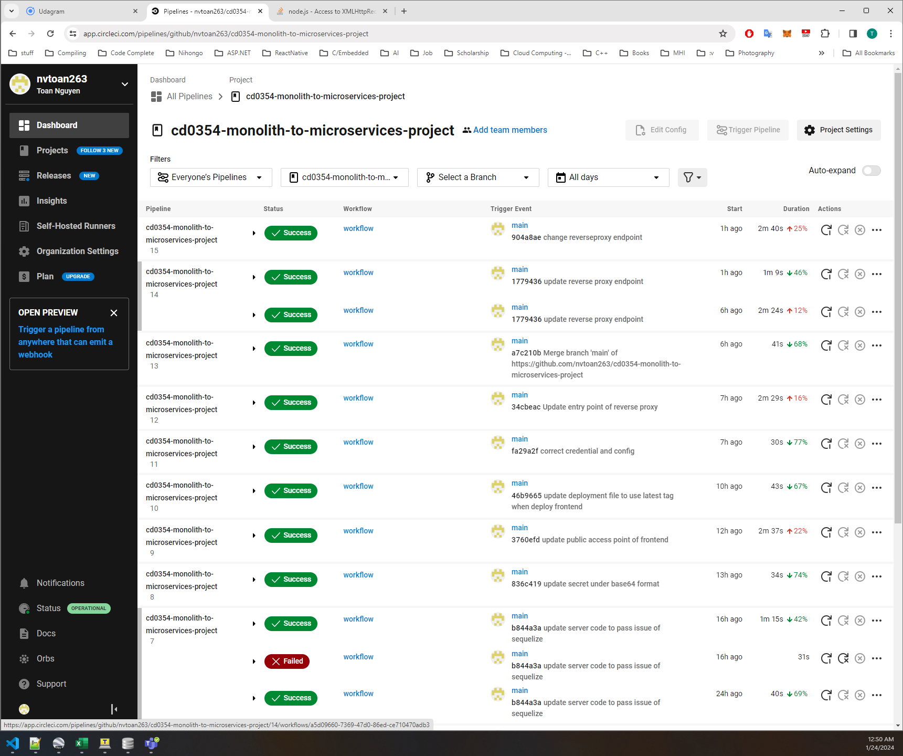
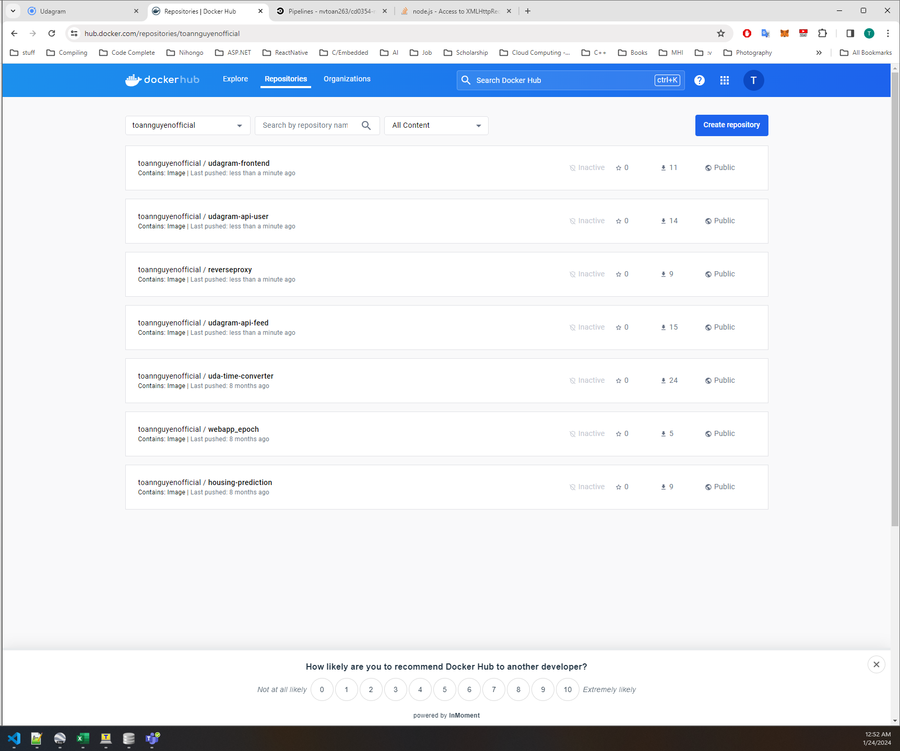
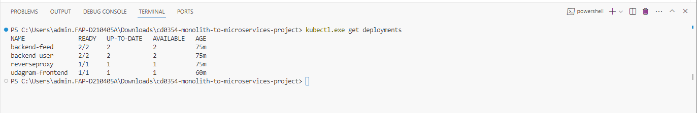
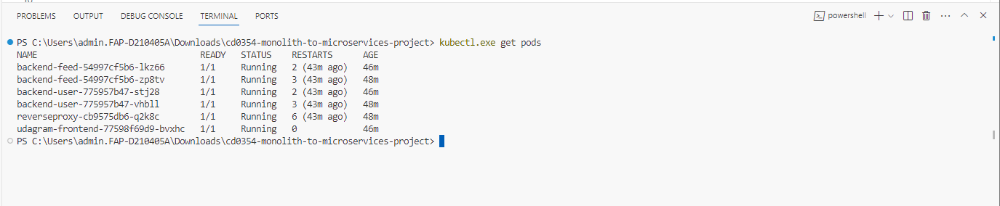
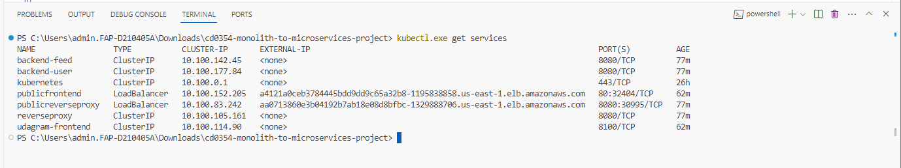
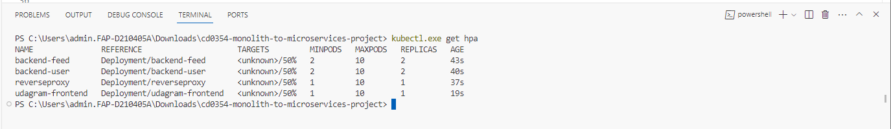

# Refactor: Udagram Image Filtering Application

__Udacity Cloud Developer Nanodegree - Project 3:__ Refactoring and Deploying the [Udacity Monolith Udagram Application](https://github.com/udacity/cd0354-monolith-to-microservices-project)

> Udagram is a simple cloud application developed alongside the Udacity Cloud Engineering Nanodegree. It allows users to register and log into a web client, post photos to the feed, and process photos using an image filtering microservice.

### 1. Refactoring the application
- Refactored the Udagram backend service ([udagram-api](https://github.com/udacity/cd0354-monolith-to-microservices-project/tree/main/udagram-api)) into [udagram-api-feed]() and [udagram-api-user]() microservices
- Added [Nginx reverseproxy]() to forward requests from the frontend application to the backend services

### 2. Containerization
- Set up dockerfiles for building containers to run the backend microservices, frontend service and Nginx reverseproxy

### 3. Circle CI Pipeline (Not using TravisCI since it require payment info)
- Set up Travis CI Pipeline integrated with Github repository to build and upload docker images to Dockerhub

__Travis-CI build__


__Dockerhub Images__


### 4. Kubernetes:

__Get Deployments__


__Get Pods__


__Get Services__


__Get hpa__


## Running

### __Prerequisite__
1. __Database:__ Create a PostgreSQL database on AWS RDS. The database is used to store the application's metadata
2. __Filestore(S3):__ Create an AWS S3 bucket. The S3 bucket is used to store images that are displayed in Udagram.

## I. Run locally with `docker-compose`

__ENV Variables:__ Configure the variables on `set_env.sh` and run the script
> __Note:__ Uncheck from git once configured `git rm --cached set_env.sh`

__Building Images__

```
docker-compose -f deployments/docker/docker-compose-build.yaml build --parallel
```

__Running Images__

```
docker-compose -f deployments/docker/docker.yaml up
```

##  II. Run in production with `Kubernetes`

### __Kubernetes Prerequisite:__ 
Create an EKS Cluster on AWS and Set up Nodegroups on the cluster to run the kubernetes pods

### __Kubernetes Config:__ 
Set up and apply kubernetes deployment configs

```bash
# Configure and updates the configs
> cp deployments/kubernetes/config/example.env-secret.yaml deployments/kubernetes/config/env-secret.yaml
> cp deployments/kubernetes/config/example.aws-secret.yaml deployments/kubernetes/config/aws-secret.yaml
> cp deployments/kubernetes/config/example.env-configmap.yaml deployments/kubernetes/config/env-configmap.yaml
```
```bash
# Apply configs
> kubectl apply -f deployments/kubernetes/config/env-secret.yaml
> kubectl apply -f deployments/kubernetes/config/aws-secret.yaml
> kubectl apply -f deployments/kubernetes/config/env-configmap.yaml
```

### __Create Deployments__
```bash
> kubectl apply -f deployments/kubernetes/backend-feed-deployment.yaml
> kubectl apply -f deployments/kubernetes/backend-user-deployment.yaml
> kubectl apply -f deployments/kubernetes/reverseproxy-deployment.yaml
> kubectl apply -f deployments/kubernetes/frontend-deployment.yaml
```

### __Create Services__
```bash
> kubectl apply -f deployments/kubernetes/backend-feed-service.yaml
> kubectl apply -f deployments/kubernetes/backend-user-service.yaml
> kubectl apply -f deployments/kubernetes/reverseproxy-service.yaml
> kubectl apply -f deployments/kubernetes/frontend-service.yaml
```

### __Create Horizotal Pod Autoscaller (HPA)__

```
kubectl autoscale deployment backend-feed --cpu-percent=50 --min=2 --max=10
kubectl autoscale deployment backend-user --cpu-percent=50 --min=2 --max=10
kubectl autoscale deployment reverseproxy --cpu-percent=50 --min=1 --max=10
kubectl autoscale deployment udagram-frontend --cpu-percent=50 --min=1 --max=10
```